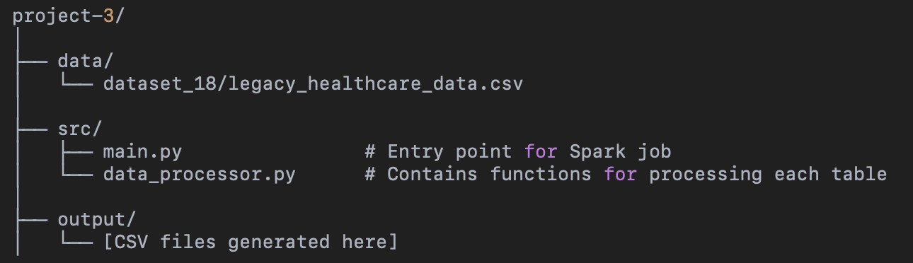
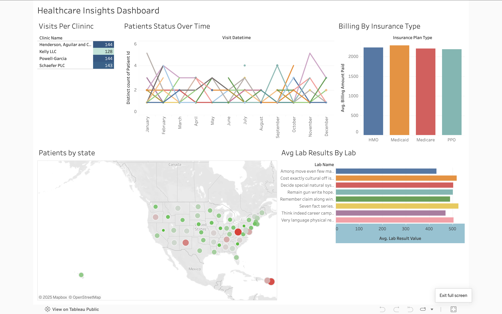

# 🏥 Project 3: Healthcare Data Normalization & Visualization

## 📌 Introduction

This project focuses on transforming **legacy flat-structured healthcare data** into a clean, normalized **snowflake schema** using **Apache Spark (PySpark)**.

The raw dataset is a single CSV file containing information about:

- Patient demographics
- Doctor appointments
- Diagnoses
- Billing and insurance
- Prescriptions and treatments
- Lab results

Our goal is to process this flat data and normalize it into **11 relational tables** (10 dimensions and 1 fact table) for efficient querying and data analysis. We also use **Tableau** to visualize key trends and insights based on the transformed data.

---
### 📂 Project Structure


---
## 📂 Dataset Location

The raw legacy dataset is stored in: data/dataset_18/legacy_healthcare_data.csv

This file is read by PySpark and split into multiple normalized CSVs based on the ER diagram.

---

## 📦 Required Packages

Make sure you have the following installed on your system:

### ✅ Python & Spark

- **Python** (v3.7+ recommended)
- **Apache Spark** (v3.x)
  - Install using Homebrew (macOS):  
    `brew install apache-spark`

### ✅ Python Libraries

Install these using pip (preferably in a virtual environment):

```bash
pip install pyspark
pip install black  # optional, for formatting
```

💡 Note: On macOS, if you’re using pip3, use pip3 install ... instead.

🧠 What the Code Does

The `main.py` script performs the following:

1. Reads the flat legacy CSV using Spark.
2. Passes it through helper functions from `data_processor.py`.
3. Processes and normalizes the data into 11 tables (`DimPatient`, `DimInsurance`, `DimBilling`, etc.).
4. Each DataFrame is written to a CSV file in the `output/` folder.
5. Spark-generated temporary folders are flattened so filenames are clean (e.g., `DimPatient.csv`, not `part-0000...`).

🚀 How to Run the Code
	1.	Open a terminal and navigate to the project root directory (contains /src, /data, and /output folders).
	2.	Use this command to run the script with Spark:
Run with: `spark-submit src/main.py`

This will:
•	Load data from data/dataset_18/legacy_healthcare_data.csv
•	Generate clean CSVs for each of the 11 tables
•	Save outputs to the output/ folder

If the output CSVs already exist, they will be overwritten.

📁 Output Files (Snowflake Schema)

The output is saved under:
/output/

- DimPatient.csv  
- DimInsurance.csv  
- DimBilling.csv  
- DimProvider.csv  
- DimLocation.csv  
- DimPrimaryDiagnosis.csv  
- DimSecondaryDiagnosis.csv  
- DimTreatment.csv  
- DimPrescription.csv  
- DimLabOrder.csv  
- FactVisit.csv

Final Deliverables
- Normalized 11-table Snowflake Schema output (as individual CSVs)
- Correct column names and order per schema
- Patient Active/Inactive status based on last visit before 2022
- Flattened output CSVs (no part-0000 Spark folders)
- Code structured with modular processing functions
- Fully reproducible with spark-submit src/main.py

## ✅ Validation Script

A helper script `normalization_validation.py` is included in `/src` to validate:

- Dimension table primary key constraints
- Fact table foreign key relationships

### 🔍 To run the validation:

```
cd src
python3 normalization_validation.py
```

### 📊 Tableau Dashboard: Healthcare Insights

[](https://public.tableau.com/app/profile/karthik.pachabatla/viz/Book2_17441311252890/Dashboard1?publish=yes)

This dashboard visualizes key insights from the normalized healthcare dataset using five different plots:

- Visits per Clinic Shows the count of patient visits per clinic location. Useful for identifying high-traffic clinics.

- Patient Status Over Time Displays active/inactive patients month-wise to observe visit trends and engagement.

- Billing by Insurance Type Compares the average billing amount paid across different insurance plan types.

- Patients by State A geospatial map showing where most patients are located in the U.S. 

- Average Lab Result by Lab Name Highlights how lab result values vary across labs. Helps spot anomalies or variations.


